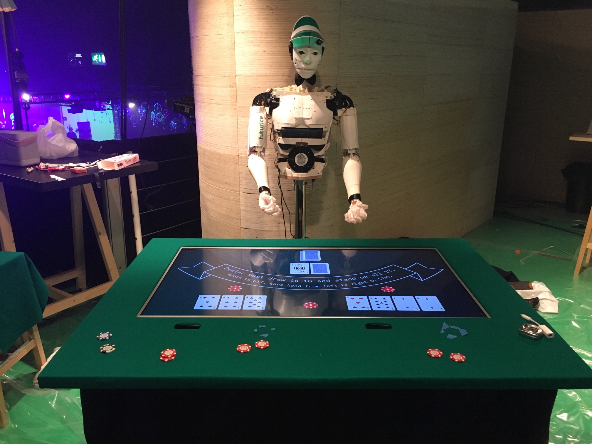

# Inmoov BlackJack

This is gonna be the coolest blackjack table ever, hosted by a robot.

- Arduino-folder contains code for the KnockSensor to detect "hit me" gesture.
- Java/leapmotion has code for detecting "stay" gesture.
- Java/blackjack has code for the blackjack engine which is the "brains"
- Java/knock-sensor has code for reading serial port and converting that to UDP traffic. for Knock sensors and RFID readers.
- Octave-folder contains scripts for creating the AI model using [Octave](https://www.gnu.org/software/octave/)

Front end will be coded with Unity and the star of the show is the [InMoov robot](http://inmoov.fr/).

## HW

HW setup consists of 

- [InMoov Robot](http://inmoov.fr/)
- LCD Display embedded to a table (any display will do)
- 2x RFID readers (for betting). Any RFID reader works which shows up as (virtual) COM port
- 2x Leap motion contollers (for swiping/staying)
- 2x Piezo-electric vibration sensors (for knocking/hitting). These are used via [Arduino SW](/Arduino/KnockSensor) (Uno and Yun tested)

We used Parallax RFID readers but you should be able to use any. Knock sensors were piezo-electric vibration sensors connected using Arduino (tested with Uno and Yun). Some specs can be found from [hw-folder](/hw).

## Running

[Java/blackjack-project](/Java/blackjack) contains the actual app which controls the game. It will open a UDP server for listening incoming messages from sensors and based on the input and the game progress it will command the UI and the robot, also with UDP messages.

Robot and UI message protocols are similar but not identical, due to different needs. Protocol could be refactored and possibly converted to use f.ex JSON payloads instead of proprietary string messages.

[scripts](/scripts)-folder contains useful scripts (see [README](/scripts/README.md)) for launching all sensors and mapping the serial ports but you can also start everything manually.

